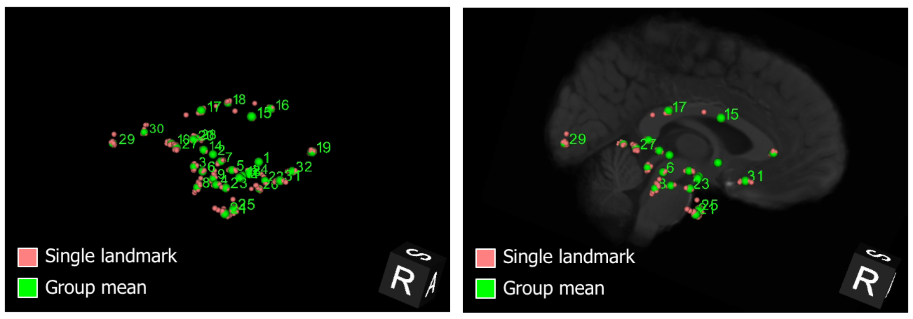

# AFIDs

An open framework for evaluating correspondence in brain images and teaching neuroanatomy using anatomical fiducial placement

* The [AFID protocol](protocol.md) is an anatomical fiducial placement protocol that has been validated and used for teaching at a number of local and [BHG-related events](https://github.com/jclauneuro/BHG18_landmarkprotocol)
* AFID placement is reproducible, not overtly manually intensive (20-40 minutes once trained), and more sensitive to local registration errors than standard voxel overlap measures.
* This protocol and study framework leverages open resources and tools, and has been developed with full transparency in mind so that others may freely use, adopt, and modify.
* 60+ raters trained to date.

## References and Resources

### Publications

* Lau JC, Parrent AG, Demarco J, Gupta G, Park PJ, Ferko K, Khan AR, Peters TM. AFIDs: an open framework for evaluating correspondence between magnetic resonance images of the human brain using fiducial placement. F1000 Research. Demo presented at INCF NeuroInformatics in Montreal, QC, Canada. 2018. [[ref](http://dx.doi.org/10.7490/f1000research.1115895.1)]
* Preprint coming soon!

### Open Datasets
* **Agile12v2016:** Lau JC, MacDougall KW, Arango MF, Peters TM, Parrent AG, Khan AR: Ultra-High Field Template-Assisted Target Selection for Deep Brain Stimulation Surgery. World Neurosurg 103:531–537, 2017. [[download](https://www.nitrc.org/projects/deepbrain7t/)] [[ref](http://dx.doi.org/10.1016/j.wneu.2017.04.043)]
* **Colin27:** Holmes CJ, Hoge R, Collins L, Woods R, Toga AW, Evans AC: Enhancement of MR Images Using Registration for Signal Averaging. J Comput Assist Tomogr 22:324–333, 1998. [[download](http://nist.mni.mcgill.ca/?p=935)] [[ref](http://dx.doi.org/10.1097/00004728-199803000-00032)]
* **MNI152NLin2009bAsym:** Fonov V, Evans AC, Botteron K, Almli RR, McKinstry RC, Collins LL, et al: Unbiased average age-appropriate atlases for pediatric studies. Neuroimage 54:313–327, 2011. [[download](http://www.bic.mni.mcgill.ca/ServicesAtlases/ICBM152NLin2009)] [[ref](http://dx.doi.org/10.1016/j.neuroimage.2010.07.033)]
* **OASIS1:** Marcus DS, Fotenos AF, Csernansky JG, Morris JC, Buckner RL: Open Access Series of Imaging Studies: Longitudinal MRI Data in Nondemented and Demented Older Adults. J Cogn Neurosci 22:2677–2684, 2010. [[download](https://www.oasis-brains.org)] [[ref](http://dx.doi.org/10.1162/jocn.2009.21407)]

### Software
* **3D Slicer:** Fedorov A, Beichel R, Kalpathy-Cramer J, Finet J, Fillion-Robin JC, Pujol S, et al: 3D Slicer as an image computing platform for the Quantitative Imaging Network. Magn Reson Imaging 30:1323–1341, 2012. [[download](https://www.slicer.org/)] [[ref](http://dx.doi.org/10.1016/j.mri.2012.05.001)]

### Historical References
* **Talairach1957:** Talairach J, David M, Tournoux P, Corredor H, Kvasina T: Atlas d’anatomie Stéréotaxique. Repérage Radiologique Indirect Des Noyaux Gris Centraux Des Régions Mésencephalosousoptique et Hypothalamique de l’homme. Paris, France: Masson & Cie, 1957
* **Talairach1988:** Talairach J, Tournoux P: Co-Planar Stereotaxic Atlas of the Human Brain: 3-D Proportional System: An Approach to Cerebral Imaging. ed 1, Thieme, 1988.

## Other Resources
* [Website](https://github.com/jclauneuro/BHG18_afidprotocol) for the AFID32 protocol as taught as a training workshop for BHG18
* [Tutorial](https://github.com/BrainhackWestern/BrainhackWestern.github.io/wiki/Tutorials) given as part of BHG18 [[video](https://www.youtube.com/watch?v=huGtd19_uiM)]
* Download [Slicer](https://www.slicer.org)
* [AFID validator](http://fidvalidator.pythonanywhere.com/vib1) (alpha stage); started at [BHG18-Western](https://github.com/BrainhackWestern/BrainhackWestern.github.io/wiki/projects#landmark-validator)
