# Fiducial Protocol

## Preparation
* Download and use Slicer 4.6.2

## Naming Scheme for Fiducial Files
* [VolumeID]_[Contrast]_[Rater]_[N] (e.g. MNI2009b_T1_JL_1_20170511)
  * [VolumeID] = the identifier for the volume on which you are performing the fiducial placements; for the tutorial it will be one of the well known MRI templates:
    * Colin27: average of 27 Colin brains
    * MNI2009b: average of 152 healthy controls
    * Agile12v1.0: average of 12 healthy controls at 7T
  * [Contrast] = T1, T2, PD, other (typically will be T1)
  * [Rater] = the unique identifier for the rater performing the fiducial placement; convention will be first initial and last name to prevent overlap
  * [N] = reference for fiducial placement session (helpful if performing placements more than once; starting with 1)
  * [YYYYMMDD] = year month and date

## AC-PC Placement
* Download assigned volume/template from Dropbox or USB.
* Go to Markups Module and create Module named ACPC_[VolumeID]_[Rater]_[N]. Place AC and PC landmarks: 
  1. AC = anterior commissure (center)
  2. PC = posterior commissure (center)
* Save the fiducial file locally first and copy it into the Dropbox directory called UPLOAD_ACPC.

## Apply existing AC-PC Transform
Go to Transforms Module and apply existing ACPC Transform to volume. Will see the template shift in space. Note: The AC-PC fiducials placed in the previous step will no longer be aligned to the appropriate locations. This is okay. Go back to the Markups Module, click on ACPC_[VolumeID]_[Rater]_[N] and make the fiducials invisible.

## Create new AC-PC Transform
To create a new AC-PC Transform place AC and PC fiducial Markers in previous step. Created ACPC Line and Midline under Markup>List. Next copy AC and PC into ACPC Line and Midline Lists. Select Midline list and place a fiducial marker in the superior interpeduncular fossa (Axial view to targeting) and name it Midline. Under modules select Registration>Specialized>ACPC Transform. Under ACPC transform tab select Parameter Set dropdown tab and click ACPC transform. Below that is the Transform Panel, under ACPC Line select ACPC Line, under Midline select Midline, and under Output transform select New Linear Transform and name it output transform. Click apply at the bottom of the window. Next under Modules go to Transforms and under Active Transform dropdown tab select output transform. Under Apply Transform Select all 4 lists (i.e Colin27_t1_tal_hires, ACPC Line, Midline etc.) and transfer them to the transformed side. 
General Fiducial Placement Strategies
Use the "Jump to Slice" feature to center your view on the fiducial of interest and ensure that the placed landmark appears accurate on all three standard views (axial, sagittal, coronal). Once a fiducial is placed, dragging the fiducial can allow for more refined placement. Holding down shift centers the view in all views on the cursor (use along with crosshair function). If a given fiducial is classified as [midline], jump to an existing midline fiducial (e.g. AC or PC) and start by placing the fiducial on the sagittal view and refine placement using the other views. Try to place fiducials at the boundary/edge of the feature of interest. For some of the fiducials, the instructions for placement will explicitly say to place the landmark using information mostly from one view (e.g. axial view for olfactory sulcus). Be aware that changing the windowing of your images (and lighting in the room) may affect your perception of where landmarks should be placed. When you're satisfied with the location of a fiducial, lock it in place to prevent yourself from displacing it later. NOTE: there is no UNDO feature for fiducial placements.
Placement of Fiducial Series
Create a new Markup list entitled Fid32_[VolumeID]_[Rater]_[N]. Click on ACPC Line and copy over AC and PC to your new list by right clicking each fiducial, choosing "Copy fiducial to another list", and selecting Fid32_[VolumeID]_[Rater]_[N]. Place the following 30 fiducials, enter the number corresponding to the fiducial in the Name textbox and enter the underlined anatomical structure in the corresponding Description textbox:

## 1. AC [midline]

## 2. PC [midline]

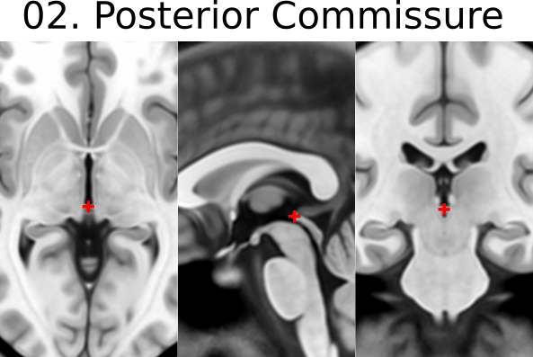

## 3. infracollicular sulcus [midline]
  * inferior part of sulcus of inferior colliculi at the midline junction of inferior colliculi
  * Inferiormost boundary of longitudinal intercollicular sulcus

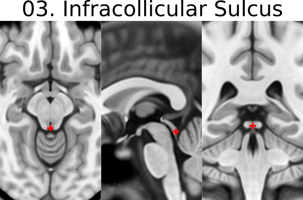
  
## 4. PMJ = pontomesencephalic junction [midline]
  * At the junction but because it doesn't end on a sharp point choose the ventral/inferior/pontine side of the junction using the sagittal and coronal views
  
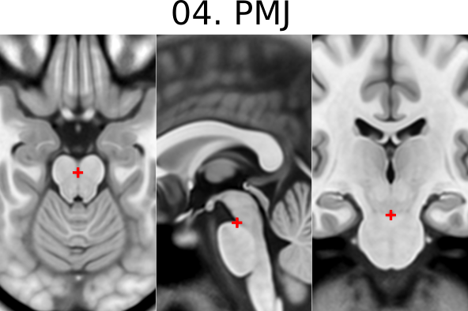
  
## 5. superior interpeduncular fossa [midline]
  * most superior axial slice
  * Use coronal slice to help optimize location at boundary of 3rd ventricle and surrounding brain
  * Commentary: nice landmark for DBS since subthalamic nucleus close by
  
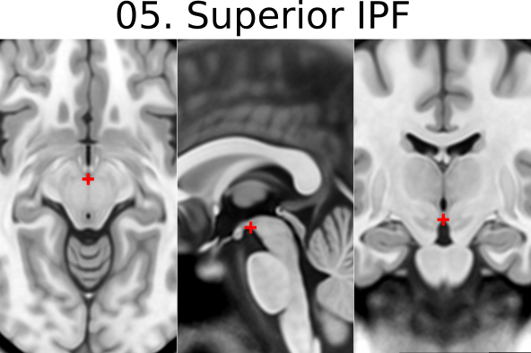
  
## 6. R superior LMS = right superior lateral mesencephalic sulcus
  * Localize using axial slices; at boundary of CSF and brain
  

  
## 7. L superior LMS = left superior lateral mesencephalic sulcus (as in 6)

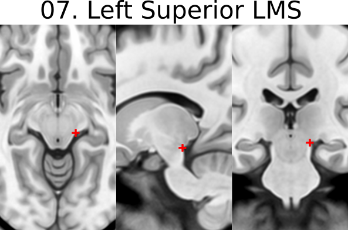

## 8. R inferior LMS = right inferior lateral mesencephalic sulcus
  * Localize at junction between midbrain and pons first using axial slices
  * Then refine positioning using sagittal view (at the change in angle of brainstem at the PMJ)
  
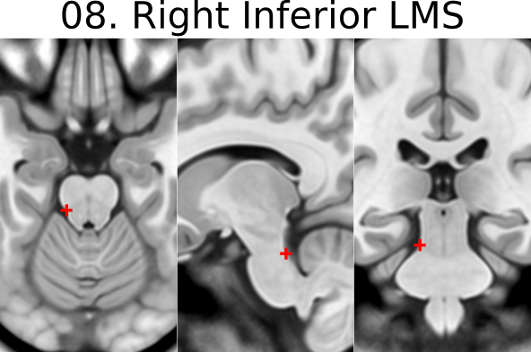
  
## 9. L inferior LMS = left inferior lateral mesencephalic sulcus (as in 8)

## 10. Culmen [midline]
  * most superior point of cerebellar vermis; one of the vermian lobules
  
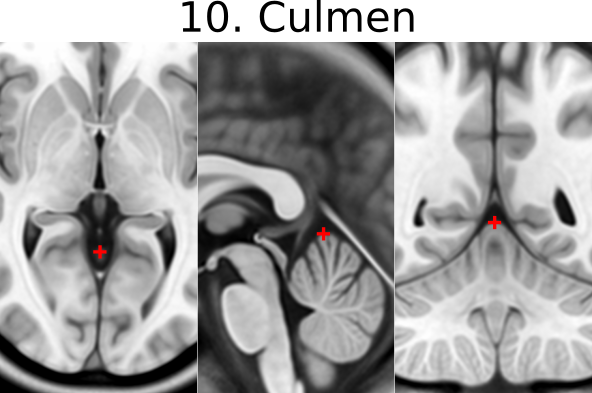
  
## 11. Intermammillary sulcus [midline]
  * Midpoint between the mamillary bodies

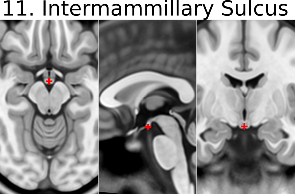  
  
## 12. R MB = right mammillary body (center)

## 13. L MB = left mamillary body (center)

## 14. pineal gland [midline]

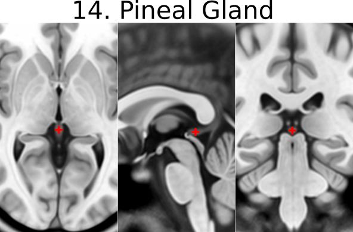

## 15. R LV at AC = right lateral aspect of frontal horn on coronal section of AC
  * Defined at same coronal slice as AC (jump to it)
  

  
## 16. L LV at AC = left lateral aspect of frontal horn on coronal section of AC (as in 15)

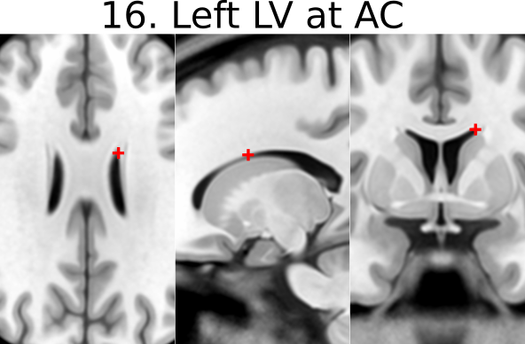

## 17. R LV at PC = right lateral aspect of frontal horn on coronal section of PC

## 18. L LV at PC = left lateral aspect of frontal horn on coronal section of PC (as in 17)

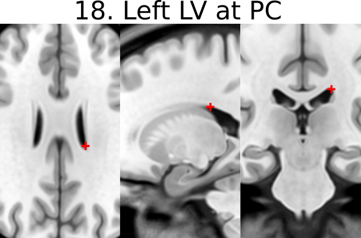

## 19. Genu of CC = genu of corpus callosum [midline]
  * Place using sagittal view and optimizing as most anterior point on coronal slice
  
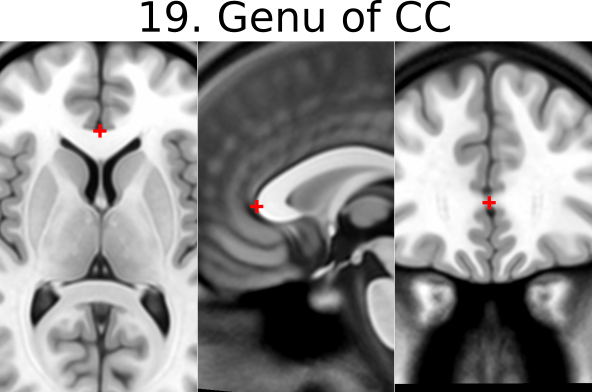
  
## 20. Splenium of CC = splenium of the corpus callosum [midline]
  * Place using sagittal view and optimize as inferiormost point on axial section
  

  
## 21. R AL temporal horn = right anterolateral temporal horn
  * Place using coronal view as anteriormost (and lateral) point of temporal horn
  * Choose a more ventral/inferior point on the coronal view
  * Place at the boundary of CSF and brain
  
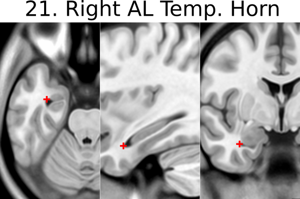
  
## 22. L AL temporal horn = left anterolateral temporal horn (as in 21)

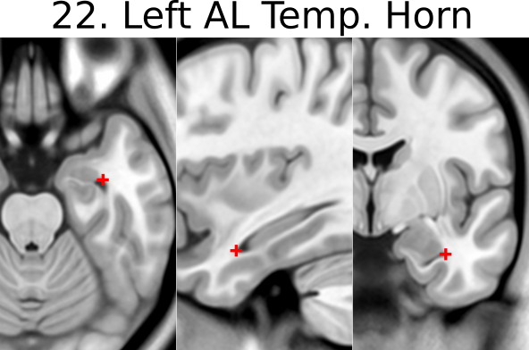

## 23. R superior AM temporal horn = Rhoton's R uncal recess
  * At the superior hippocampal-amygdalar transition area (HATA); NOTE: there is also an inferior anteromedial temporal horn
  * Rhoton's uncal recess: "narrow medially projecting space between hippocampal head & ventricular surface of amygdala located lateral to uncal apex")
  * Place at the boundary of CSF and brain
  
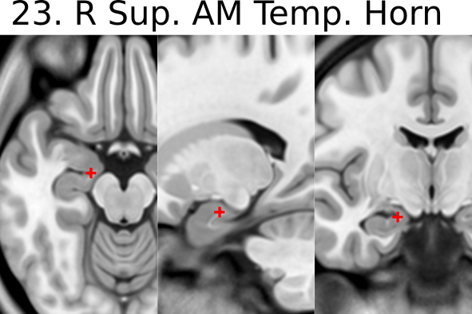
  
## 24. L superior AM temporal horn = Rhoton's L uncal recess (as in 23)

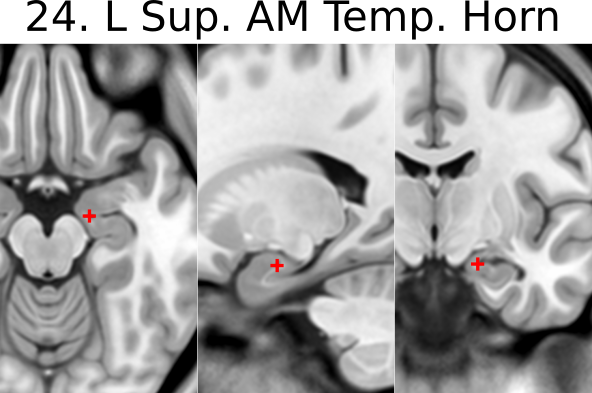

## 25. R inferior AM temporal horn
  * Initially place using coronal view
  
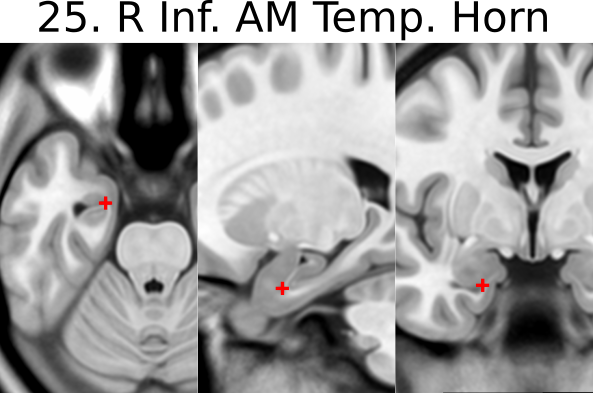
  
## 26. L inferior AM temporal horn (as in 25)

## 27. R indusium griseum origin
  * Defined on sagittal slice at takeoff from posterior hippocampus below splenium
  
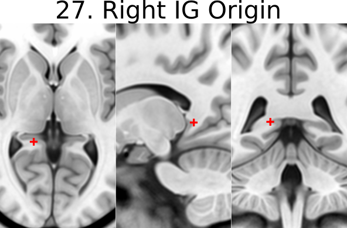
  
## 28. L indusium griseum origin (as in 27)

## 29. R ventral occipital horn
  * Defined on ventral/inferior portion of last visible coronal slice with occipital horn
  * Optimize using other views
  

  
## 30. L ventral occipital horn (as in 29)

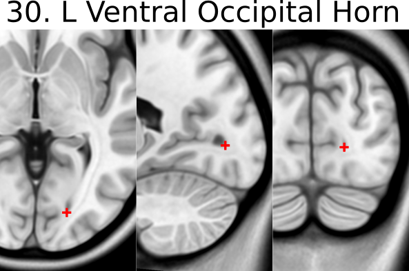

## 31. R olfactory sulcal fundus
  * Sulcal fundus = at depth of sulcus and boundary of gray matter-white matter
  * Posterior and most superior portion visible on axial slice

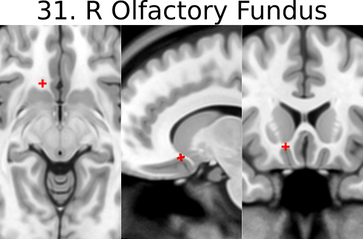
  
## 32. L olfactory sulcal fundus (as in 31)

Save the fiducial file (.fcsv) locally.

## Resources:
* Tutorial given as part of Brainhack Western 2018: https://www.youtube.com/watch?v=huGtd19_uiM
* Git repository for BHG18 tutorial results: https://github.com/jclauneuro/BHG18_landmarkprotocol/
